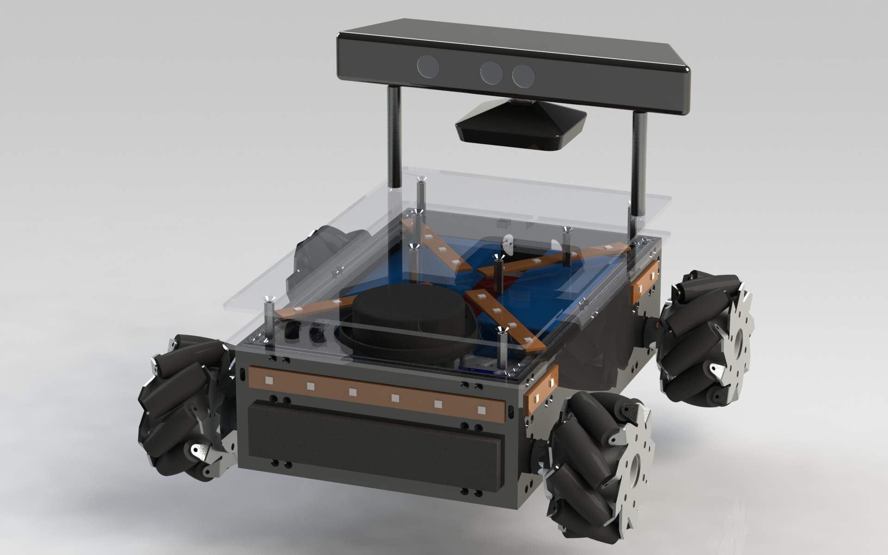

Mecanumbot-CAD
==============

Solidworks files for the Mecanumbot robot.

## Todo List

Problems with current design:

* very hard to service
 * too many little screws
 * the robot is very tightly packed
* placing an object on the platform blocks the view of the Kinect
 * would ideally like to use a 3D sensor to identify an object on the plaform, but the Kinect's minimum distance is past the front face of the robot, so this doesn't work
* battery plugs are difficult to connect and disconnect
* current battery space was optimized for 4S lipos, but only 3s lipos are being used

Ideas for improvements

* group wires between top and bottom plates into one bundle
* would like to enable automatic charger with a charging dock
* model the mecanum wheels
* export the model to the ROS urdf to display in rviz
